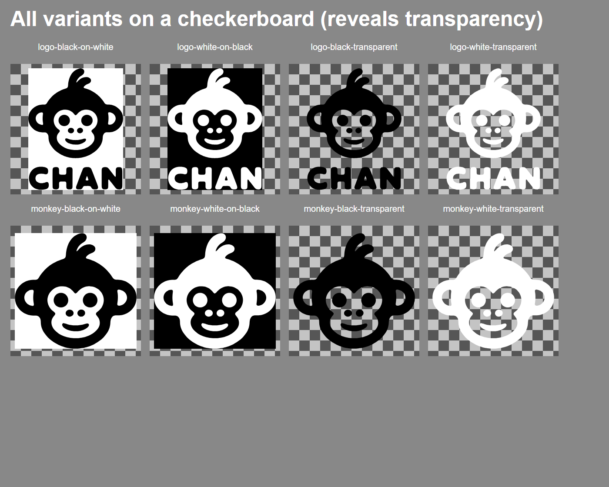

# Chan Meng — Personal Brand Logo

A personal-brand monkey logo, reconstructed from a hand-drawn original into clean
**mathematical curves**. The hand-drawn source was made of hundreds of hand-placed
points (`L` segments) — rough, unmeasurable and hard to edit. Every contour is now
fitted to a small set of **smooth cubic Bézier curves** (genuine parametric
polynomial functions), with the eyes emitted as **exact circles**.

The result **faithfully preserves the original** — smooth, full and cute, right down
to the **off-center hair curl** — while being fully mathematical: reproducible,
infinitely scalable, and parametrically tweakable.


> In the diff panel the image is almost entirely black (only hair-thin edges remain),
> which means the reconstruction matches the original very closely.

## Logo variants

Ready-to-use exports live in [`assets/`](assets) — the **full lockup** (monkey + CHAN)
in [`assets/full/`](assets/full) and the **monkey only** (cropped, for avatars / app
icons / favicons) in [`assets/monkey/`](assets/monkey), each in four color schemes.

Each variant is a **single-color knockout**: the head is one ink colour and the face
+ inner ears are **transparent holes**. On the solid-background versions those holes
show the background colour; on the transparent versions they are genuinely
see-through, so the backdrop shows through the monkey's face. Use the **black**
variants on light backgrounds and the **white** variants on dark ones.



| File | Content | Ink | Background | Best on |
|---|---|---|---|---|
| `assets/full/chan-meng-logo-black-on-white.svg` | monkey + CHAN | black | white | light surfaces |
| `assets/full/chan-meng-logo-white-on-black.svg` | monkey + CHAN | white | black | dark surfaces |
| `assets/full/chan-meng-logo-black-transparent.svg` | monkey + CHAN | black | transparent | light / colored |
| `assets/full/chan-meng-logo-white-transparent.svg` | monkey + CHAN | white | transparent | dark / colored |
| `assets/monkey/chan-meng-monkey-black-on-white.svg` | monkey only | black | white | light surfaces |
| `assets/monkey/chan-meng-monkey-white-on-black.svg` | monkey only | white | black | dark surfaces |
| `assets/monkey/chan-meng-monkey-black-transparent.svg` | monkey only | black | transparent | light / colored |
| `assets/monkey/chan-meng-monkey-white-transparent.svg` | monkey only | white | transparent | dark / colored |

## Animated marks

Three CSS-animated variants live in [`assets/anime/`](assets/anime). All are single files
with no JavaScript and no external dependencies — drop them in with `` and
they just play.

<p align="center">
  <picture>
    <source media="(prefers-color-scheme: dark)" srcset="assets/anime/chan-monkey-live-on-white.svg">
    
  </picture>
</p>

| File | What it does | Loop |
|---|---|---|
| `assets/anime/chan-monkey-live.svg` | Eight emoji-style expressions — 😊 happy, 🥰 love, 😎 cool, 😅 sweat, 🤔 thinking, 😮 wow, 🧣 cozy, 😴 sleepy — across a four-season cycle with drifting cherry petals, a summer sun, falling leaves and snow | 100 s |
| `assets/anime/chan-monkey-live-on-white.svg` | The same 100 s piece, sitting on a white card so it survives a dark backdrop | 100 s |
| `assets/anime/chan-monkey-blink.svg` | The plain mark, blinking occasionally | 5 s |

The head geometry is byte-identical to `assets/monkey/chan-meng-monkey-black-transparent.svg`
in all three files — expressions are drawn in the same ink and live inside the transparent face
hole, and only the seasonal particles and the winter props introduce color. All honour
`prefers-reduced-motion: reduce`, falling back to the plain static mark — on its card, in the
case of the on-white variant.

**Which one on a dark background?** The static variants answer that with white *ink*
(`chan-meng-monkey-white-transparent.svg`), but an ``-loaded SVG gets no
`prefers-color-scheme` hook, so a page that is light for some readers and dark for others
— a GitHub README, most obviously — cannot swap inks. `chan-monkey-live-on-white.svg`
brings its own background instead: one file that reads correctly in both themes, at the
cost of a visible card. The transparent original is still the right choice anywhere you
control the backdrop.

If you control the surrounding **markup** rather than just the URL, you have a second
option: the missing hook exists in the host page even though it does not exist inside an
``-loaded SVG. The preview above uses it — `<picture>` with a
`prefers-color-scheme: dark` source, which GitHub honours in Markdown — so light-theme
readers get the transparent original and dark-theme readers get the card:

```html
<picture>
  <source media="(prefers-color-scheme: dark)" srcset="assets/anime/chan-monkey-live-on-white.svg">
  
</picture>
```

Reach for `chan-monkey-live-on-white.svg` on its own when all you can hand someone is a
single URL — a bare ``, a profile field, a chat embed, a badge slot.

The pacing is deliberately slow — 25 s per season, 8.5 s per expression — so the mark stays
worth watching for a while instead of visibly looping.

Building another animated variant? [`docs/animating-the-mark.md`](docs/animating-the-mark.md)
is the full playbook: the layer model and invariants, the master-clock and gate-keyframe
patterns, how to measure the real geometry instead of guessing at it, the verification
harness, and a gallery of the six rendering bugs this design was shaped by.

## Project structure

```
.
├── assets/                     # ready-to-use logos
│   ├── full/                   #   monkey + CHAN wordmark (4 color schemes)
│   ├── monkey/                 #   monkey only, cropped (4 color schemes)
│   ├── anime/                  #   CSS-animated marks (blink, live, live-on-white)
│   ├── raster/                 #   generated PNGs (monkey + full, several sizes)
│   └── icons/                  #   generated favicon.ico / apple-touch-icon / PWA icons
├── src/
│   ├── build_logo.py           # SVG generator (Python stdlib, no dependencies)
│   ├── rasterize.js            # PNG + icon exporter (sharp, png-to-ico)
│   └── build-on-white.js       # derives the on-white animated card (Node stdlib)
├── docs/
│   ├── logo-math.md            # the math write-up
│   ├── animating-the-mark.md   # build guide for the CSS-only animated variants
│   ├── comparison.png          # original / reconstruction / diff
│   └── variants-preview.png    # all variants on a checkerboard
├── archive/
│   └── chan-meng-logo-original-handdrawn.svg   # the original hand-drawn source
├── package.json                # npm run rasterize
└── README.md
```

## Usage

```bash
python src/build_logo.py        # regenerates the SVGs under assets/full/ and assets/monkey/
npm install && npm run rasterize # regenerates assets/raster/ and assets/icons/
npm run build:on-white          # regenerates assets/anime/chan-monkey-live-on-white.svg
```

`build_logo.py` has no third-party dependencies (Python standard library only); the
rasterizer needs `sharp` and `png-to-ico`. The generator reads the archived original and
rewrites all variants. To trade smoothness against fidelity,
edit the `(resample_step, smoothing_passes)` for each contour in the `TUNING` dict at
the top of `src/build_logo.py` (larger step → smoother and fewer curves; smaller →
closer to the original); to add a color scheme, extend the `VARIANTS` list at the
bottom. Re-run to regenerate — fully reproducible.

`chan-monkey-live.svg` and `chan-monkey-blink.svg` are **not** generated by
`build_logo.py` or `rasterize.js`. They are hand-maintained and embed the generated head
geometry verbatim, so if the mark is ever re-tuned the new path data has to be copied into
them by hand. `chan-monkey-live-on-white.svg` is the exception: it is derived from
`chan-monkey-live.svg` by `build-on-white.js` and should never be hand-edited — re-run the
script instead, and re-run it after any change to its source.

## The mathematical method (why this version is smooth and full)

Rather than *approximating* the shape with a few idealized primitives (which throws
away the hand-drawn fullness and charm), this approach **fits smooth curves along
the original's real outline**. Each contour is resampled to uniform arc length,
lightly smoothed to remove hand jitter, then turned into a chain of cubic Bézier
segments via a closed Catmull-Rom spline. Each segment is a parametric polynomial:

```
B(t) = (1-t)³P₀ + 3(1-t)²t·C₁ + 3(1-t)t²·C₂ + t³P₃,  t ∈ [0,1]
```

The curve passes through every sample point and is everywhere tangent-continuous
(C¹), so it hugs the original shape while staying naturally smooth. See
[`docs/logo-math.md`](docs/logo-math.md) for the full details.

## Brand & usage

The **code** (`src/build_logo.py`) is free to read, learn from, and adapt. The
**Chan Meng monkey logo and the “CHAN” wordmark are a personal brand identity** —
please don't use them to represent yourself, your project, or your organization.
