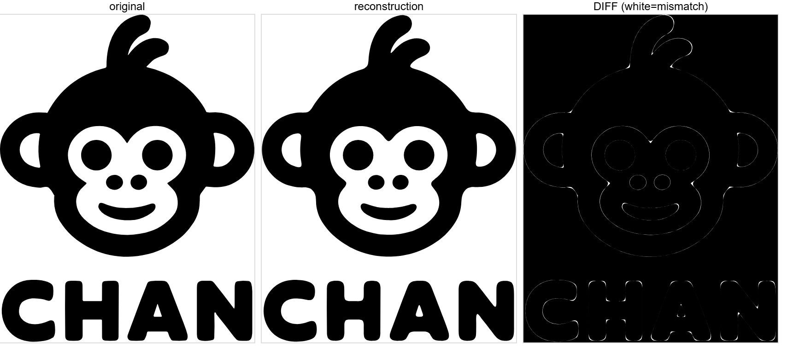

# Chan Meng — Personal Brand Logo (Mathematical Reconstruction)

A reconstruction of a hand-drawn personal-brand logo (`chan-monkey-logo-black.svg`)
— originally made of **hundreds of hand-placed points** (`L` segments), so it was
rough, unmeasurable and impossible to edit cleanly — rebuilt with **mathematical
curves**: every contour is fitted to a small set of **smooth cubic Bézier curves**
(genuine parametric polynomial functions), with the eyes emitted as **exact circles**.

The result **faithfully preserves the original** — smooth, full and cute, right down
to the **off-center hair curl** — while being fully mathematical: reproducible,
infinitely scalable, and parametrically tweakable.



> In the diff panel the image is almost entirely black (only hair-thin edges remain),
> which means the reconstruction matches the original very closely.

## Logo variants

Ready-to-use exports live in [`variants/`](variants) — full lockup (monkey + CHAN)
and monkey-only (cropped, for avatars / app icons / favicons), each in four color
schemes. Each variant is a **single-color knockout**: the head is one ink colour and
the face + inner ears are **transparent holes**. On the solid-background versions
those holes show the background colour; on the transparent versions they are
genuinely see-through, so the backdrop shows through the monkey's face. Use the
**black** variants on light backgrounds and the **white** variants on dark ones.


| File | Content | Ink | Background | Best on |
|---|---|---|---|---|
| `variants/chan-meng-logo-black-on-white.svg` | monkey + CHAN | black | white | light surfaces |
| `variants/chan-meng-logo-white-on-black.svg` | monkey + CHAN | white | black | dark surfaces |
| `variants/chan-meng-logo-black-transparent.svg` | monkey + CHAN | black | transparent | light / colored |
| `variants/chan-meng-logo-white-transparent.svg` | monkey + CHAN | white | transparent | dark / colored |
| `variants/chan-meng-monkey-black-on-white.svg` | monkey only | black | white | light surfaces |
| `variants/chan-meng-monkey-white-on-black.svg` | monkey only | white | black | dark surfaces |
| `variants/chan-meng-monkey-black-transparent.svg` | monkey only | black | transparent | light / colored |
| `variants/chan-meng-monkey-white-transparent.svg` | monkey only | white | transparent | dark / colored |

All variants are regenerated by `build_logo.py` from the same fitted curves; edit the
`VARIANTS` list at the bottom of the script to add more color schemes.

## Files

| File | Description |
|---|---|
| `chan-monkey-logo-black.svg` | The original hand-drawn logo (input) |
| `build_logo.py` | **Generator**: parses the original → resample + smooth + Catmull-Rom / cubic-Bézier fit → writes the new SVG |
| `chan-monkey-logo-math.svg` | **Canonical reconstruction**: ~724 cubic Bézier segments + 2 exact circles (full lockup, black on white) |
| `variants/` | **Ready-to-use exports**: full + monkey-only, in 4 color schemes each (see below) |
| `logo-math.md` | **Math write-up**: Bézier definition, coordinate system, the Catmull-Rom → Bézier formula, per-contour parameters and segment counts |
| `comparison.png` | Side-by-side: original / reconstruction / difference |
| `variants-preview.png` | Contact sheet of all variants on a checkerboard |

## Usage

```bash
python build_logo.py
# optional: python build_logo.py output.svg
```

No third-party dependencies (Python standard library only). To trade smoothness
against fidelity, edit the `(resample_step, smoothing_passes)` for each contour in
the `TUNING` dict at the top of `build_logo.py`: a larger step → smoother and fewer
curves; a smaller step → closer to the original. Re-run to regenerate — fully
reproducible.

## The mathematical method (why this version is smooth and full)

Rather than *approximating* the shape with a few idealized primitives (which throws
away the hand-drawn fullness and charm), this approach **fits smooth curves along
the original's real outline**. Each contour is resampled to uniform arc length,
lightly smoothed to remove hand jitter, then turned into a chain of cubic Bézier
segments via a closed Catmull-Rom spline. Each segment is a parametric polynomial:

```
B(t) = (1-t)³P₀ + 3(1-t)²t·C₁ + 3(1-t)t²·C₂ + t³P₃,  t ∈ [0,1]
```

The curve passes through every sample point and is everywhere tangent-continuous
(C¹), so it hugs the original shape while staying naturally smooth. See
`logo-math.md` for the full details.
